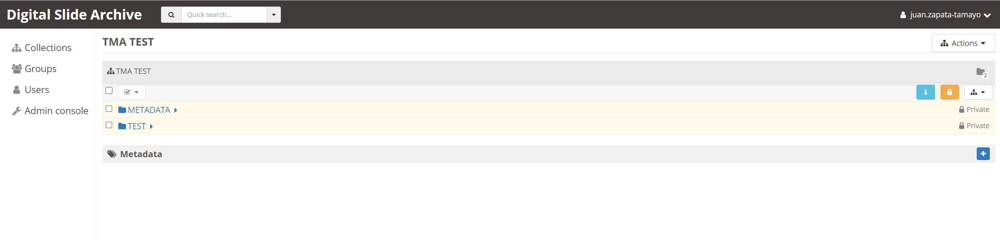

# Associated File Management Plugin

Girder plugin for File Management
# How to use the plugin?
Everything is linked by the key `patientId` it should be an de-identfied ID that allow us to link the pdf files (usually patient reports files) to the images

**1.** Navigate to the intended file location within any folder (although we recommend creating a folder named "METADATA").
<p align="center">
  
</p>

**2.** Upload the desired PDF file.
<p align="center">
  
</p>

**3.** Include the 'patientId' key in the metadata.
<p align="center">
  
</p>

**4.** Locate the image where the PDF should be linked.
<p align="center">
  
</p>

**5.** Integrate the 'patientId' key in the respective location.
<p align="center">
  
</p>

**6.** Access the HistomicsUI view to observe the organized folder structure with all the linked documents.
<p align="center">
  
</p>

# How to install the plugin?

For installing the plugin you will need to run the following command
```bash
pip install associated_file_management
```
# Development
## Before installing and running the plugin:
Be sure to have the following technologies installed with the required version:

 - NodeJS `12.22.x`
	 - You can install `nvm ` for easy node version management
 - Girder
 - HistomicsUI
	 - It needs to be installed as a plugin
	 - You'll need to follow the installation guide in the [plugin's repository](https://github.com/DigitalSlideArchive/HistomicsUI#installation)
 - Python
 - PIP
 - Docker
	 - With the CLI commands enabled (for running `docker` and `docker-compose`)

## Local Development:
For local development you'll need to follow some steps:

 **1.** Make sure you have the right `node` version installed locally, we recommend to use `nvm` for managing `node` versions:
```bash
> nvm use 12.22.12
```
**2.** In other terminal, in the root folder, run `docker`, it will create a container running `mongodb` :
```bash
> docker-compose up
```
**3.** Once the container is running, in other terminal run:
```bash
> girder build --dev
```
**4.** Then, finally, serve the plugin:
```bash
> GIRDER_MONGO_URI='mongodb://localhost:51467/girder' girder serve --dev
```
* *You'll need to specify the URL where docker is running, for that use* 

If you want to watch the changes when you are coding use the following command:
- *For ubuntu and MAC users*:
```bash
> sudo ls associated_file_management/web_client/**/*.js | entr -r -s 'girder build --dev --no-reinstall && GIRDER_MONGO_URI='mongodb://localhost:61784/girder' girder serve --dev'
```
> *This command will listen to any change that you do in the web_client .js files and build & serve again the project without re-installing node modules.*

# Deployment
**0.** Go to the the container bash and go to the `opt` folder:
```bash
docker exec -it <container name> /bin/bash
cd ..
```

**1.** Clone the repository into the container:
```bash
git clone https://github.com/steveneschrich/histomics-file-management
```

**2.** Install the plugin:
```bash
cd histomics-file-management
pip install .
```

**3.** Build the plugin using `girder`:
```bash
girder build --mode=production
```

